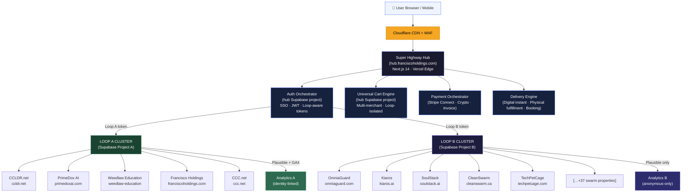
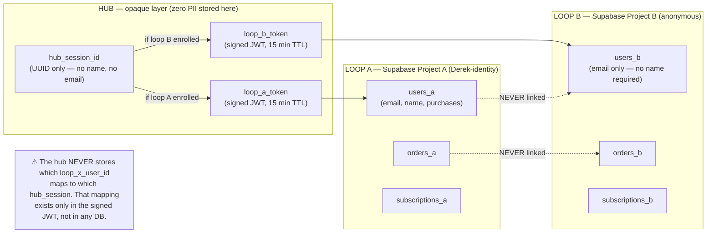
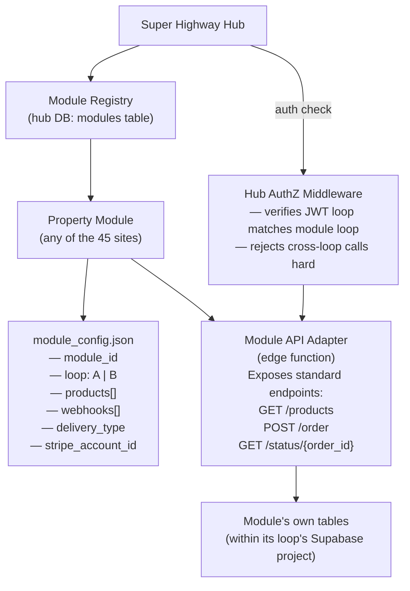
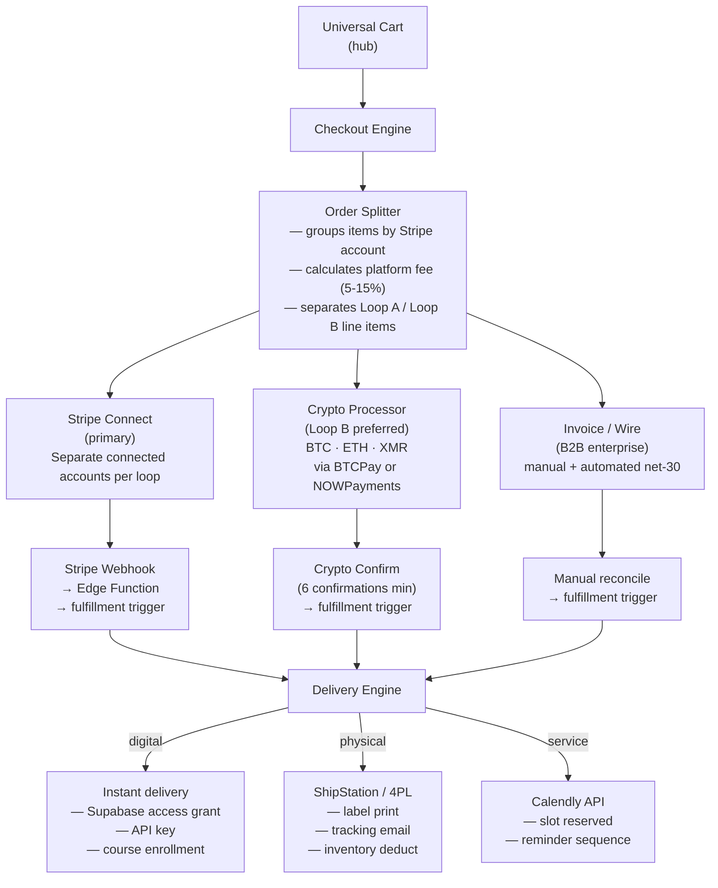
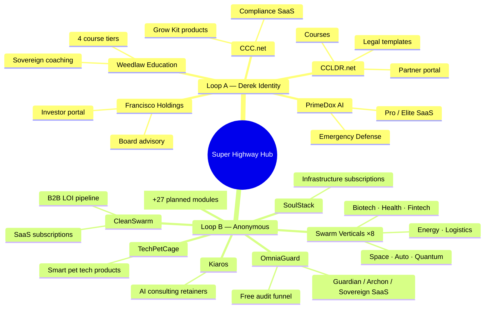

# Super Highway — Architecture Diagram
**Phase 1 Deliverable 1 of 7 — June 6, 2026**

---

## 1. Top-Level System Overview

---

## 2. Identity Loop Isolation — Data Flow Detail

---

## 3. Module Integration Architecture

---

## 4. Payment Orchestration Flow

---

## 5. Full 45-Module Map (Current + Planned)

---

## 6. Technology Stack Decision Tree

```mermaid
graph LR
    FE["Frontend\nNext.js 14\nTailwind CSS\nVercel Edge"]
    AUTH2["Auth\nSupabase Auth × 3 projects\n(hub / loop-A / loop-B)"]
    DB["Database\nPostgreSQL via Supabase\nRow-Level Security throughout"]
    PAY2["Payments\nStripe Connect\nBTCPay Server / NOWPayments\nManual invoice"]
    AI["AI Layer\nClaude (support + recommendations)\nOpenAI fallback for embeddings"]
    ANALYTICS2["Analytics\nGA4 + Plausible (Loop A)\nPlausible only (Loop B)"]
    HOSTING["Hosting\nVercel (Next.js)\nCloudflare (CDN + WAF + DNS)"]
    SHIPPING["Fulfillment\nShipStation (physical)\nPrint-on-demand (Printify/Printful)\nCustom webhook (digital)"]

    FE --> AUTH2 --> DB --> PAY2 --> AI
    AI --> ANALYTICS2 --> HOSTING --> SHIPPING
```

