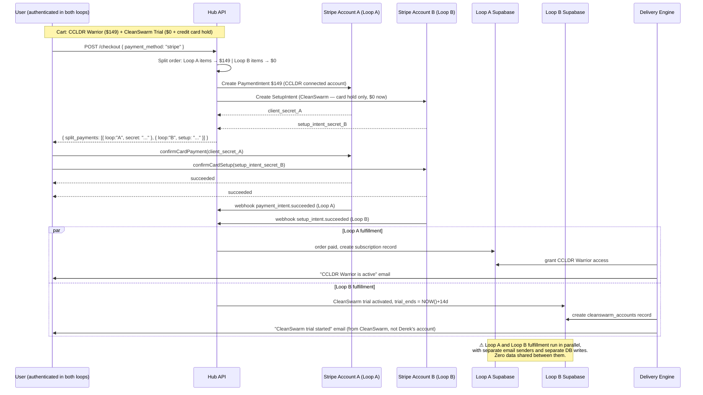
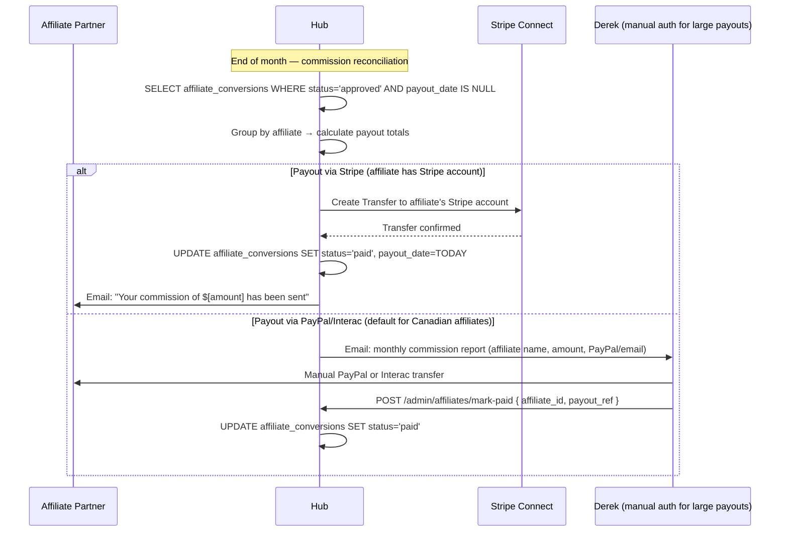

# Super Highway — Payment Flow Diagrams
**Phase 1 Deliverable 5 of 7 — June 6, 2026**

---

## Flow 1 — Digital Product Purchase (Stripe, single loop)

```mermaid
sequenceDiagram
    participant U as User Browser
    participant HUB as Hub API
    participant STRIPE as Stripe Connect
    participant LOOP as Loop A or B Supabase
    participant DELIVER as Delivery Engine

    U->>HUB: POST /cart/items { sku: "PRIMEDOX-EMERGENCY-099" }
    HUB-->>U: cart updated (total: $99.00 CAD)

    U->>HUB: POST /checkout { payment_method: "stripe" }
    HUB->>STRIPE: Create PaymentIntent ($99.00 to connected account, platform fee $9.90)
    STRIPE-->>HUB: { client_secret: "pi_xxx_secret" }
    HUB-->>U: { stripe_client_secret: "pi_xxx_secret", checkout_id: "uuid" }

    U->>STRIPE: Stripe.js confirmCardPayment(client_secret, card_element)
    STRIPE-->>U: { status: "succeeded" }

    STRIPE->>HUB: POST /webhooks/stripe { type: "payment_intent.succeeded" }
    HUB->>LOOP: UPDATE orders SET payment_status='paid'
    HUB->>DELIVER: trigger_fulfillment(order_id, product_sku, loop_user_id)
    DELIVER->>LOOP: INSERT access_grants { user_id, product, expires_at: null }
    DELIVER->>U: Email: "Your access is ready — [link]"

    HUB-->>STRIPE: 200 OK (within 5s)
```

---

## Flow 2 — Multi-Module Purchase (cart spans Loop A + Loop B)



---

## Flow 3 — Subscription Renewal (automated)

```mermaid
sequenceDiagram
    participant STRIPE as Stripe Connect
    participant HUB as Hub Webhook Handler
    participant LOOP as Loop Supabase
    participant EMAIL as Email Service

    Note over STRIPE: Monthly billing date arrives

    STRIPE->>HUB: POST /webhooks/stripe { type: "invoice.payment_succeeded", subscription_id: "sub_xxx" }
    HUB->>LOOP: UPDATE subscriptions SET current_period_end = NOW()+30d, status='active'
    HUB->>EMAIL: Send renewal receipt
    HUB-->>STRIPE: 200 OK

    alt Payment fails
        STRIPE->>HUB: POST /webhooks/stripe { type: "invoice.payment_failed" }
        HUB->>LOOP: UPDATE subscriptions SET status='past_due'
        HUB->>EMAIL: Send "payment failed — update card" email
        Note over HUB: Stripe retries at 3d, 5d, 7d (Smart Retries)
        
        alt Still unpaid after final retry
            STRIPE->>HUB: { type: "customer.subscription.deleted" }
            HUB->>LOOP: UPDATE subscriptions SET status='cancelled'
            HUB->>LOOP: DELETE access_grants WHERE user_id=... AND module=...
            HUB->>EMAIL: Send "access suspended — resubscribe" email
        end
    end
```

---

## Flow 4 — Crypto Payment (Loop B preferred path)

```mermaid
sequenceDiagram
    participant U as User
    participant HUB as Hub API
    participant BTCPAY as BTCPay Server (self-hosted)
    participant HUB_WH as Hub Webhook Handler
    participant LOOP as Loop B Supabase
    participant DELIVER as Delivery Engine

    U->>HUB: POST /checkout { payment_method: "crypto" }
    HUB->>BTCPAY: Create Invoice { amount_usd: 99, order_id: "uuid", currency_pref: "BTC" }
    BTCPAY-->>HUB: { invoice_id, btc_address, btc_amount, expires_at }
    HUB-->>U: { crypto_payment_address: "bc1q...", crypto_amount_btc: "0.00098", expires_at: "+60min" }

    U->>U: Send BTC to bc1q... from personal wallet

    BTCPAY->>BTCPAY: Monitor chain — 1st confirmation detected
    Note over BTCPAY: Wait for 6 confirmations (~60 min for BTC)
    
    BTCPAY->>HUB_WH: POST /webhooks/crypto { status: "confirmed", invoice_id, tx_hash }
    HUB_WH->>LOOP: UPDATE orders SET payment_status='paid', crypto_tx_hash='0x...'
    HUB_WH->>DELIVER: trigger_fulfillment(order_id)
    DELIVER->>LOOP: INSERT access_grants
    DELIVER->>U: Email: "Access confirmed — [link]"

    alt Payment expires (no tx after 60 min)
        BTCPAY->>HUB_WH: { status: "expired" }
        HUB_WH->>LOOP: UPDATE orders SET payment_status='failed'
        HUB_WH->>U: Email: "Your crypto payment window expired — retry here [link]"
    end
```

---

## Flow 5 — Interac e-Transfer (manual, current fallback path)

```mermaid
sequenceDiagram
    participant U as User
    participant HUB as Hub API
    participant DEREK as Derek Francisco (manual review)
    participant LOOP as Loop Supabase
    participant DELIVER as Delivery Engine

    U->>HUB: POST /checkout { payment_method: "interac" }
    HUB->>LOOP: INSERT order { payment_status: 'pending', payment_method: 'interac' }
    HUB-->>U: {
        "invoice_number": "FHI-2026-0042",
        "send_to": "franciscoderek7@gmail.com",
        "amount": "$99.00 CAD",
        "memo": "PrimeDox Emergency Defense — FHI-2026-0042",
        "due_date": "2026-06-09"
    }

    U->>U: Sends Interac e-Transfer to franciscoderek7@gmail.com

    DEREK->>DEREK: Receives transfer, verifies memo matches invoice

    DEREK->>LOOP: PATCH orders SET payment_status='paid' (via admin dashboard or direct DB)
    LOOP->>DELIVER: trigger via DB trigger or manual Edge Function call
    DELIVER->>LOOP: INSERT access_grants
    DELIVER->>U: Email: "Payment confirmed — access is live"

    Note over DEREK,LOOP: This flow is manual until Stripe is fully unblocked.<br/>Target: migrate all volume to Stripe within 30 days.
```

---

## Flow 6 — Affiliate Commission Payout



---

## Platform Fee Structure

| Item                        | Platform cut (Francisco Holdings) | Module receives |
|-----------------------------|----------------------------------|-----------------|
| Digital one-time            | 10%                               | 90%             |
| SaaS subscription           | 5%                                | 95%             |
| Physical product            | 15%                               | 85%             |
| Service booking             | 12%                               | 88%             |
| Affiliate-driven conversion | 5% (platform) + affiliate rate    | remainder       |

Platform fees are deducted via Stripe Connect's `application_fee_amount` parameter at charge creation — no manual accounting required.
